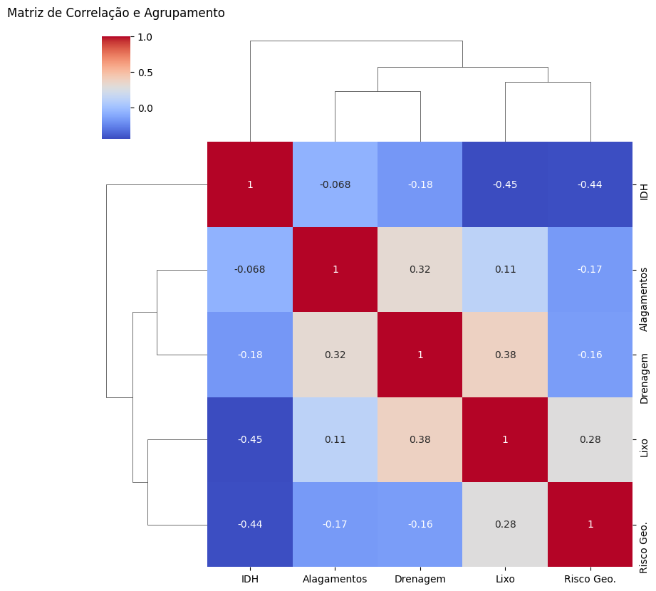
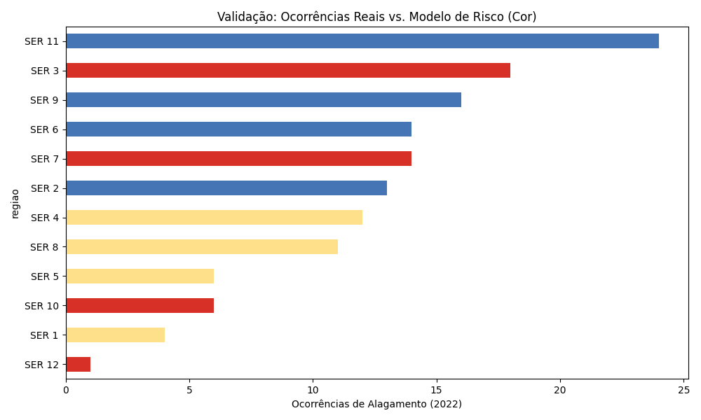
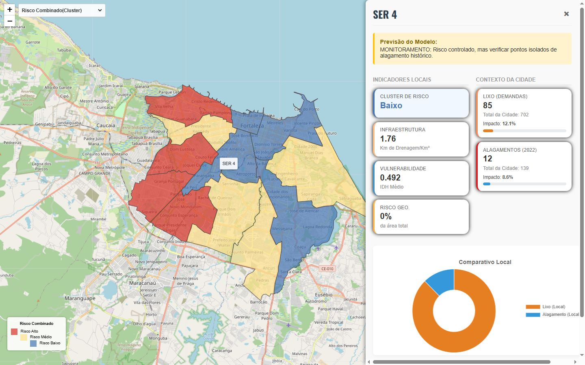

# Análise Multivariada de Risco de Alagamento - Fortaleza

> **AVISO IMPORTANTE (DISCLAIMER):** > Este software é um **protótipo acadêmico** desenvolvido para fins de estudo e extensão universitária.  
> Os índices de risco, predições ("predicts") e correlações apresentados aqui são baseados em modelos heurísticos e dados amostrais.  
> **Este projeto NÃO deve ser utilizado como base oficial para tomadas de decisão de órgãos públicos, Defesa Civil ou planejamento urbano.**

---

## Sobre o Projeto

Originalmente concebido para analisar a relação entre o **descarte irregular de lixo** e os alagamentos em Fortaleza, este projeto evoluiu para uma **Análise Multivariada de Riscos**.

Durante a investigação de dados (Big Data), identificou-se que o lixo, embora seja um agravante crítico, não atua isoladamente. O alagamento em Fortaleza é um fenômeno sistêmico, resultado da interação entre fatores geográficos, sociais e de infraestrutura.

O sistema desenvolvido processa dados heterogêneos para gerar um **Índice Ponderado de Risco**, classificando as Secretarias Regionais (SERs) em níveis de vulnerabilidade (Baixo, Médio e Alto).

O projeta conta com a supervisão de uma GEM a *Big Data Specialist*, assistente personalizada de I.A do Google Gemini. Ela foi treinada com pdf's como o de *plano municipal de drenagem* feito pela **Secretaria Municipal de Urbanismo e Meio Ambiente (SEUMA)** e a da *análise espacial das ocorrências de alagamentos urbanos na microbacia do riacho Pajeú em Fortaleza* pelo **Brazilian Geographical Journal**. Também foi instruída à se especializar e responder de forma coerente e objetiva dúvidas sobre como tratar dados e a forma mais otimizada de usá-los.

O código se encontra bem comentado, visando a compreensão de terceiros no projeto em grupo para que, caso queiram, modifiquem com o objetivo de melhorar a aplicação. 

### Objetivos
* Integrar bases de dados desconexas (Geologia, Hidrologia, Social e Zeladoria Urbana).
* Superar a análise simplista (apenas chuva x alagamento) para uma visão holística.
* Fornecer uma visualização geoespacial interativa para compreensão dos riscos.

---

## Metodologia e Dados

O "cérebro" do projeto (`etl.py`) utiliza Python (Pandas/Geopandas) para cruzar dados geográficos e estatísticos. Utilizamos uma lógica de **Densidade Areal** e **Normalização** para evitar distorções entre regionais de tamanhos diferentes.

**Variáveis analisadas:**
1.  **Risco Geológico e Inundação (Peso: 30%):** Áreas naturais de bacias e encostas.
2.  **Lixo (Peso: 15%):** Densidade de demandas de entulho/poda por km².
3.  **Infraestrutura (Peso: 15%):** Densidade da rede de drenagem (fator mitigador).
4.  **Vulnerabilidade Social (Peso: 10%):** Baseado no IDH (Índice de Desenvolvimento Humano).

---

## Resultados Visuais

Abaixo, alguns dos *outputs* gerados automaticamente pelo nosso pipeline de dados:

### 1. Matriz de Correlação (A Prova Matemática)
Este Heatmap valida a nossa tese: o Risco Geológico tem uma correlação muito mais forte com os alagamentos do que o Lixo isoladamente.


### 2. Classificação de Risco (O Modelo)
As barras coloridas representam o risco calculado pelo nosso algoritmo. Note como as barras vermelhas (Alto Risco) coincidem com as regionais que tiveram os maiores picos reais de alagamento.


### 3. Dashboard Interativo
Interface web desenvolvida com Leaflet.js e Chart.js para exploração dos dados.



---

## Visão de Futuro (Roadmap)

Embora este protótipo utilize modelos estatísticos ponderados, a visão de longo prazo para este software é ambiciosa:

* **Inteligência Artificial Treinada:** Migrar de modelos heurísticos, como a GEM usada aqui, para modelos de *Machine Learning* supervisionados, treinados com milhões de datapoints históricos de chuvas e ocorrências da última década.
* **Chatbot Cidadão:** Implementar uma interface conversacional (NLP) onde qualquer cidadão possa perguntar: *"Minha rua corre risco de alagar hoje?"* e receber uma resposta baseada em dados hiper-locais.
* **Granularidade Extrema:** Descer do nível de "Regional" para o nível de "Rua/Condomínio", permitindo alertas preventivos personalizados.
* **Software Livre:** Disponibilizar a ferramenta gratuitamente para apoio à comunidade e transparência de dados.

---

## Fontes de Dados e Referências

Este projeto consolidou dados públicos provenientes de diversas agências governamentais e estudos técnicos. Abaixo estão as fontes originais:

### Bases de Dados Geoespaciais
* **Limites Administrativos (Regionais e Bairros):** Plataforma [Fortaleza em Mapas](https://mapas.fortaleza.ce.gov.br/) (Prefeitura de Fortaleza).
* **Risco Geológico e Inundação:** Serviço Geológico do Brasil (SGB/CPRM).
* **Infraestrutura de Drenagem e Canais:** Secretaria Municipal de Urbanismo e Meio Ambiente (SEUMA).

### Referências Bibliográficas
As premissas para a ponderação do índice de risco foram baseadas nos seguintes estudos técnicos:

1.  **FORTALEZA, Prefeitura Municipal.** *Plano Municipal de Saneamento Básico: Drenagem e Manejo das Águas Pluviais Urbanas*. Secretaria Municipal de Urbanismo e Meio Ambiente (SEUMA), 2015.
2.  **SILVA, R. A.; SILVA, R. S.** *Entre o Clima e a Cidade: análise das ocorrências em áreas de riscos climáticos na cidade de Fortaleza*. Instituto de Pesquisa e Planejamento de Fortaleza (IPPLAN).
3.  **SANTOS, J. M.; PAULA, D. P.** *Análise Espacial das Ocorrências de Alagamentos Urbanos na Microbacia do Riacho Pajeú em Fortaleza, Ceará*. Brazilian Geographical Journal, v. 12, n. 1, 2021.

---

## Tecnologias Utilizadas

* **Linguagem:** Python 3.10+
* **Análise de Dados:** Pandas, NumPy, Scikit-Learn.
* **Geoprocessamento:** Geopandas, Shapely.
* **Visualização:** Matplotlib, Seaborn.
* **Frontend/Mapa:** HTML5, CSS3, Leaflet.js, Chart.js.
* **Servidor:** Flask (Python).

---

## Como Executar

1.  Clone o repositório:
    ```bash
    git clone [https://github.com/Crtrogabriel/ProjetoBigData.git](https://github.com/Crtrogabriel/ProjetoBigData.git)
    ```
2.  Instale as dependências:
    ```bash
    pip install -r requirements.txt
    ```
3.  Processe os dados (ETL):
    ```bash
    python etl.py
    ```
4.  Inicie o servidor:
    ```bash
    python app.py
    ```
5.  Acesse no navegador: `http://127.0.0.1:5000`

---

**Desenvolvido como Projeto de Extensão Universitária.**